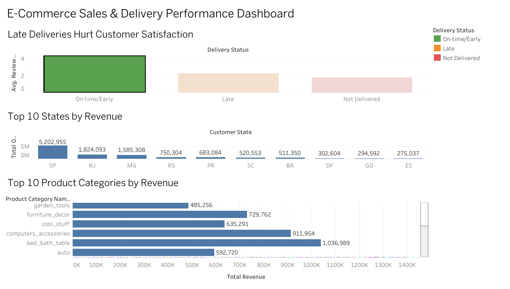

# 📦 E-Commerce Sales & Delivery Performance Analysis

**End-to-end data analytics project** uncovering the drivers of customer satisfaction, regional revenue concentration, and product category performance for a Brazilian e-commerce marketplace — built using **Python, SQL, and Tableau**.

🔗 **[View the Live Interactive Dashboard →](https://public.tableau.com/app/profile/shaima.sharfuddin/viz/ecommerce-analysis-dashboard/Dashboard1?publish=yes)**

---

## 📌 Overview

This project analyzes ~99,000 real, anonymized e-commerce orders to answer questions a real business stakeholder would ask:

- Does delivery delay actually hurt customer satisfaction — and by how much?
- Where is revenue concentrated, and is the business over-reliant on a few regions?
- Which product categories perform best, and does that vary by region?

The goal was to move beyond simple data description and produce **actionable, quantified business insights** — the kind that could directly inform logistics investment, regional marketing spend, and inventory strategy.

---

## 🛠️ Skills & Tools Demonstrated

| Category | Tools / Techniques |
|---|---|
| **Data Cleaning & Wrangling** | Python, Pandas — missing value handling, deduplication, data type conversion, multi-table merges |
| **Exploratory Data Analysis** | Pandas, Matplotlib — trend analysis, correlation testing, grouped aggregations |
| **SQL** | SQLite — multi-table JOINs, GROUP BY aggregations, CTEs, **window functions (RANK() OVER PARTITION BY)** |
| **Data Visualization / BI** | Tableau Public — interactive, stakeholder-ready dashboard with filtering |
| **Business Analysis** | KPI definition, root-cause investigation, insight-to-recommendation translation |

---

## 📊 Key Findings

| # | Finding | Business Impact |
|---|---|---|
| 1 | Late deliveries average **2.57★**, vs **4.29★** for on-time orders — a **~40% satisfaction drop** | Delivery reliability is a primary lever for customer retention |
| 2 | **63.4% of total revenue** comes from just 3 of 27 states (SP, RJ, MG) | Regional prioritization of logistics/marketing spend could significantly improve ROI |
| 3 | Top-selling product category shifts by region (e.g., *watches_gifts* leads in RJ/PR/GO; *health_beauty* leads in MG/BA/PE) | Supports a region-specific inventory and marketing strategy over a one-size-fits-all approach |

*All findings were independently validated in both Python and SQL.*

---

## 🔍 Methodology

1. **Data Cleaning** — Audited 7 related tables (~99K–112K rows each) for missing values and duplicates. Preserved missing delivery dates rather than dropping them, since they represent undelivered orders — a meaningful signal, not an error.
2. **Exploratory Analysis (Python/Pandas)** — Engineered a `delivery_delay_days` feature, joined orders with reviews, and computed revenue by region and category across multiple merged tables.
3. **SQL Validation** — Recreated all core findings in SQL for cross-verification, including an advanced query using a `RANK()` window function to identify the top-performing category **within each state**.
4. **Dashboard Design (Tableau)** — Built a 3-panel interactive dashboard translating raw analysis into a stakeholder-facing tool, with sorted, labeled, and filterable visuals.

---

## 📁 Repository Structure
├── notebooks/
│ └── ecommerce_analysis.ipynb → Full documented Python analysis
├── sql/
│ └── analysis_queries.sql → Commented SQL queries incl. window functions
├── dashboard/
│ └── dashboard_screenshot.png → Dashboard preview
└── README.md

```


## 🖼️ Dashboard Preview



---

## 📈 Dataset

[Olist Brazilian E-Commerce Public Dataset](https://www.kaggle.com/datasets/olistbr/brazilian-ecommerce) (Kaggle) — ~99,000 real, anonymized orders, 2016–2018.

```

---

## 🚀 Next Steps

Potential extensions: cohort-based retention analysis, seller-level performance scoring, and time-series forecasting of order volume for inventory planning.
